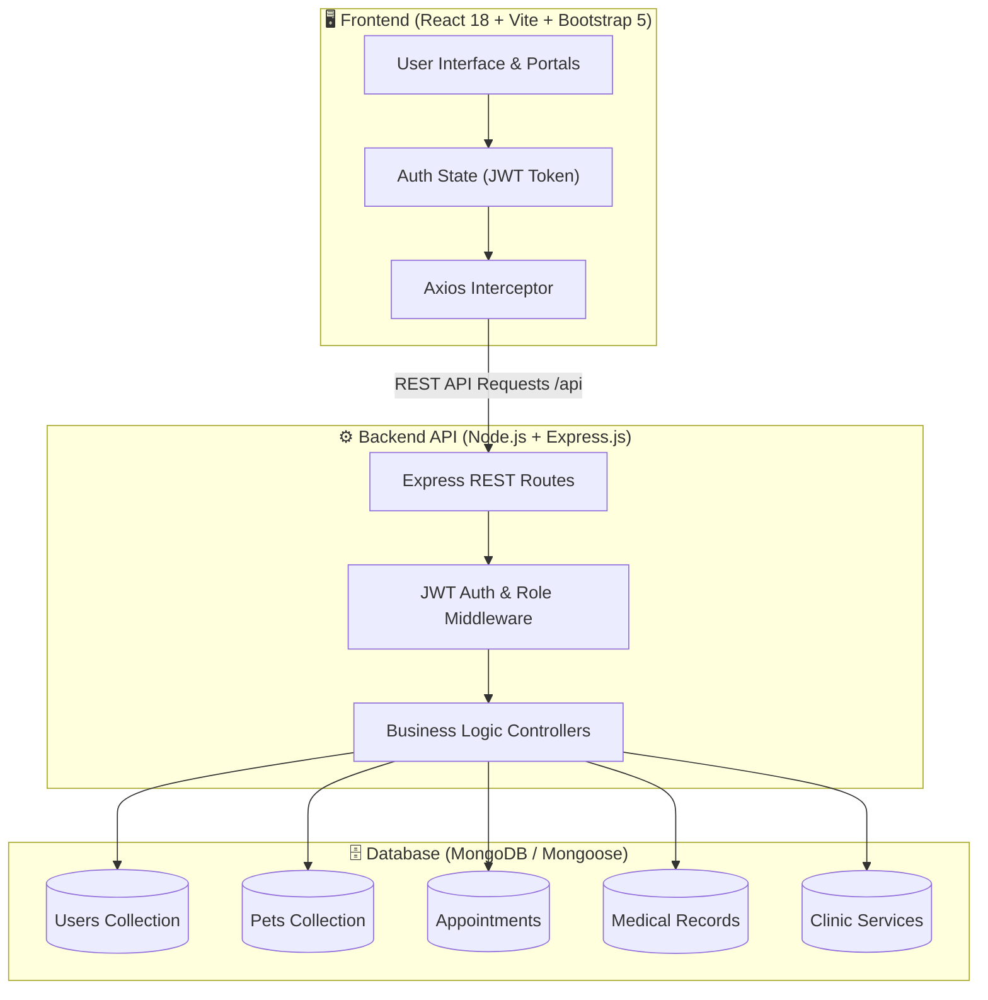

<div align="center">

# 🐾 PetCare Management System
### *Modern Full-Stack Veterinary Clinic & Pet Care Management Platform*

[](https://react.dev/)
[](https://vitejs.dev/)
[](https://nodejs.org/)
[](https://expressjs.com/)
[](https://www.mongodb.com/)
[](https://getbootstrap.com/)
[](https://shivamishra2807.github.io/PetCare-Management-System/)
[](LICENSE)

<br/>

**[🌐 Live Demo (GitHub Pages)](https://shivamishra2807.github.io/PetCare-Management-System/)** • **[📑 Postman Collection](postman_collection.json)** • **[📖 Viva & Exam Guide](VIVA_GUIDE.md)** • **[🐛 Report Bug](https://github.com/ShivamMishra2807/PetCare-Management-System/issues)**

</div>

---

## 📖 Table of Contents

- [Overview](#-overview)
- [System Architecture & Workflow](#-system-architecture--workflow)
- [Key Features](#-key-features)
- [Role-Based Access Control](#-role-based-access-control)
- [Directory Structure](#-directory-structure)
- [Tech Stack](#-tech-stack)
- [Quick Start & Local Development](#-quick-start--local-development)
- [Environment Variables](#-environment-variables)
- [REST API Endpoints](#-rest-api-endpoints)
- [Deployment Guide](#-deployment-guide)
- [Practical Experiments & Reports](#-practical-experiments--reports)
- [License](#-license)

---

## 🐶 Overview

**PetCare Management System** is a robust, full-stack web application designed for veterinary hospitals, pet clinics, and pet owners. It streamlines pet healthcare operations by providing centralized medical history, automated appointment scheduling, clinic service catalog management, and role-based administrative workflows.

---

## 🔄 System Architecture & Workflow



---

## ✨ Key Features

### 1. 🐕 Pet Management & Profiles
- Register pets with breed, age, gender, weight, identification tags, and medical notes.
- Dynamic edit, update, and deletion controls with avatar/photo preview.

### 2. 📅 Interactive Appointment Booking
- Pet owners can browse veterinary services, pick preferred doctors, choose date/time slots, and track real-time booking status (`Pending`, `Confirmed`, `Completed`, `Cancelled`).

### 3. 📋 Digital Medical Records History
- Comprehensive electronic health records (EHR) containing diagnosis, prescribed treatments, medications, vaccination history, and follow-up dates.

### 4. 🏥 Veterinary Services & Billing Catalog
- Admin & clinic staff can create, edit, price, and toggle availability of clinical procedures (Vaccinations, Surgery, Dental, Grooming, Diagnostics).

### 5. 👥 Role-Based Portals
- **Pet Owner Portal**: View personal pets, upcoming clinic appointments, and past medical prescriptions.
- **Admin / Veterinarian Dashboard**: Clinic analytics, total registered pets, pending appointments queue, medical record generator, and user access management.

---

## 🔐 Role-Based Access Control

The platform implements secure JWT token authentication with role-based authorization:

| Role | Access Level | Permissions |
| :--- | :--- | :--- |
| **Pet Owner** | Owner Portal | Register personal pets, book appointments, view personal medical histories, update profile |
| **Veterinarian** | Clinic Staff | View assigned appointments, create and update medical records, view all pet clinical histories |
| **Admin** | Command Center | Manage all users, assign roles, manage clinic services, view overall clinic analytics and bookings |

---

## 📂 Directory Structure

```
PetCare-Management-System/
├── backend/                       # Node.js + Express REST API
│   ├── config/                    # MongoDB connection configuration (db.js)
│   ├── controllers/               # Auth, Pet, Appointment, Medical, Service controllers
│   ├── middleware/                # JWT verification & Error handlers
│   ├── models/                    # Mongoose Schemas (User, Pet, Appointment, Service, etc.)
│   ├── routes/                    # Express route definitions
│   ├── seed.js                    # Initial database seeder script
│   ├── server.js                  # API entry point
│   └── package.json
│
├── frontend/                      # React 18 + Vite SPA Frontend
│   ├── src/
│   │   ├── components/            # Navbar, Footer, ProtectedRoute, Cards, Loading
│   │   ├── context/               # AuthContext & State management
│   │   ├── pages/                 # Home, Login, Register, Dashboards, Pets, Appointments
│   │   ├── services/              # Centralized Axios API instance
│   │   ├── App.jsx                # React Router v6 route configuration
│   │   └── main.jsx
│   ├── vite.config.js             # Vite configuration with base path support
│   └── package.json
│
├── .github/
│   └── workflows/
│       └── deploy-pages.yml       # Automated GitHub Pages CI/CD deployment
│
├── WT_Practical_Reports/          # Web Technology experiment reports & lab manuals
├── postman_collection.json        # Pre-configured Postman API collection
├── start_all.bat                  # One-click Windows starter script
├── VIVA_GUIDE.md                  # Comprehensive viva & project defense preparation guide
└── README.md
```

---

## 🛠 Tech Stack

| Component | Technologies |
| :--- | :--- |
| **Frontend UI** | [React 18](https://react.dev/), [Vite](https://vitejs.dev/), [React Router v6](https://reactrouter.com/), [Bootstrap 5](https://getbootstrap.com/), [Bootstrap Icons](https://icons.getbootstrap.com/), [Axios](https://axios-http.com/) |
| **Backend API** | [Node.js](https://nodejs.org/), [Express.js](https://expressjs.com/), [JWT (jsonwebtoken)](https://jwt.io/), [bcryptjs](https://github.com/dcodeIO/bcrypt.js), [CORS](https://github.com/expressjs/cors), [dotenv](https://github.com/motdotla/dotenv) |
| **Database** | [MongoDB](https://www.mongodb.com/) & [Mongoose ODM](https://mongoosejs.com/) |
| **DevOps & Deploy** | [GitHub Actions](https://github.com/features/actions), [GitHub Pages](https://pages.github.com/), [Netlify](https://www.netlify.com/) / [Render](https://render.com) |

---

## ⚡ Quick Start & Local Development

### Prerequisites
- **Node.js**: `v18.x` or `v20.x`
- **MongoDB**: Local MongoDB instance (`mongodb://localhost:27017`) or MongoDB Atlas URI

### 1. Clone the Repository
```bash
git clone https://github.com/ShivamMishra2807/PetCare-Management-System.git
cd PetCare-Management-System
```

### 2. Setup Backend
```bash
cd backend
npm install
cp .env.example .env
# Start the backend server (Runs on port 5000)
npm run dev # or node server.js
```

### 3. Setup Frontend
```bash
cd ../frontend
npm install
cp .env.example .env
# Start Vite development server (Runs on port 3000)
npm run dev
```

### 4. Windows One-Click Start
Double-click `start_all.bat` or run:
```cmd
start_all.bat
```

---

## 🔐 Environment Variables

### Backend (`backend/.env`):
```env
PORT=5000
MONGO_URI=mongodb://localhost:27017/petcare_db
JWT_SECRET=your_super_secret_jwt_key_2026
NODE_ENV=development
```

### Frontend (`frontend/.env`):
```env
VITE_API_URL=http://localhost:5000/api
```

---

## 📡 REST API Endpoints

| Method | Endpoint | Description | Auth Required |
| :--- | :--- | :--- | :--- |
| `POST` | `/api/auth/register` | Register new user | No |
| `POST` | `/api/auth/login` | Authenticate user & get JWT token | No |
| `GET` | `/api/pets` | Get all user's pets (or all pets for Admin) | Yes |
| `POST` | `/api/pets` | Add new pet profile | Yes |
| `PUT` | `/api/pets/:id` | Update pet details | Yes |
| `DELETE` | `/api/pets/:id` | Delete pet profile | Yes |
| `GET` | `/api/appointments` | List appointments | Yes |
| `POST` | `/api/appointments` | Book appointment | Yes |
| `PUT` | `/api/appointments/:id` | Update appointment status | Admin / Vet |
| `GET` | `/api/medical-records` | Fetch pet medical records | Yes |
| `POST` | `/api/medical-records` | Add new diagnosis & prescription | Admin / Vet |
| `GET` | `/api/services` | List clinic services | No |
| `POST` | `/api/services` | Add clinic service | Admin |

---

## 🚀 Deployment Guide

### Deploy Frontend to GitHub Pages
1. Go to **Settings** ➔ **Pages** in this GitHub repository.
2. Set **Source** to **`GitHub Actions`**.
3. Pushes to `main` automatically build and publish to `https://<username>.github.io/PetCare-Management-System/`.

### Deploy Backend to Render / Railway
1. Create a Web Service pointing to `backend/`.
2. Add environment variables `MONGO_URI` (from MongoDB Atlas) and `JWT_SECRET`.
3. Set Build Command: `npm install` and Start Command: `node server.js`.

---

## 📄 Practical Experiments & Lab Reports

The repository includes complete Web Technology practical manuals located in [`WT_Practical_Reports/`](WT_Practical_Reports/):
- **Experiment 1–4**: HTML5 semantic markup, CSS3 styling, responsive layouts, client validation.
- **Experiment 5–8**: JavaScript DOM manipulation, Node.js server architecture, Express routing.
- **Experiment 9–12**: MongoDB integration, RESTful CRUD APIs, React SPA component state, and JWT security.

---

## 📜 License

This project is licensed under the **MIT License**.

<div align="center">
  <sub>Developed with 🐾 for pet healthcare management and academic excellence.</sub>
</div>
